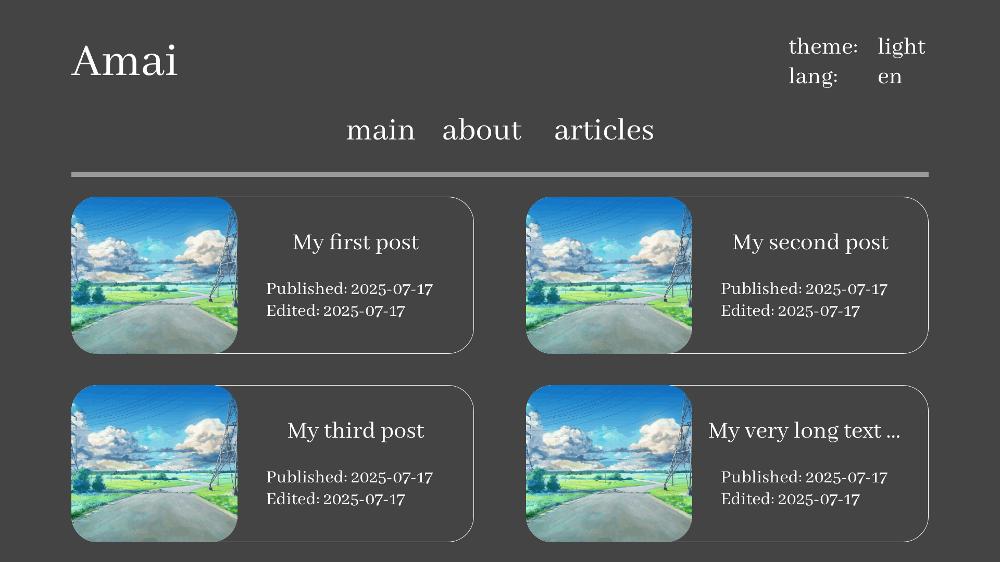

# Amai

Super simple blog. Articles can be written in Markdown.

Frontend will be added later

    

---

⭐️ Supported MD specifications ⭐️
- Markdown 1.0 (100%)
- CommonMark 0.31 (98%)
- GitHub Flavored Markdown 0.29 (97%)

🎀 Supported language 🎀
- en (100%)
- ru (100%)

---

🛠️ Tech stack 🛠️
- gin-gonic/gin
- lib/pq
- jmoiron/sqlx
- withastro/astro
- markedjs/marked

---

See full gallery [**here**](./readme/gallery)

    
    
    

