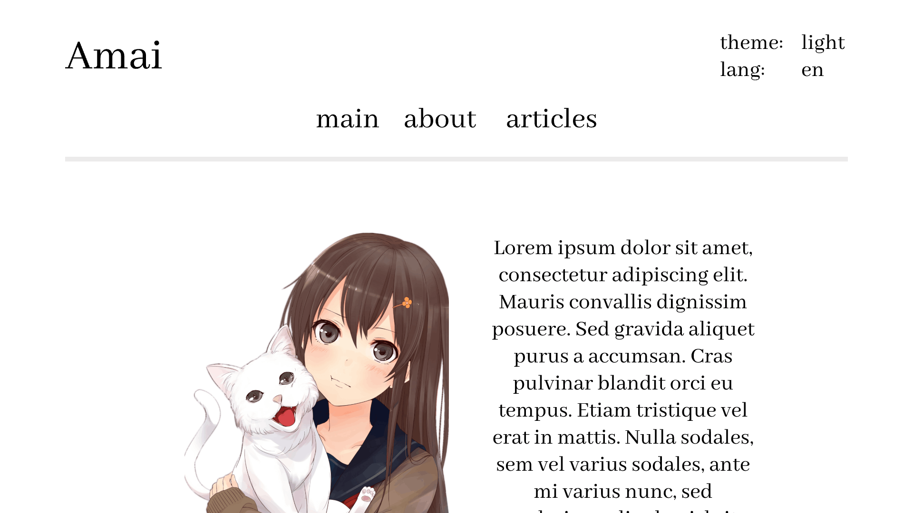
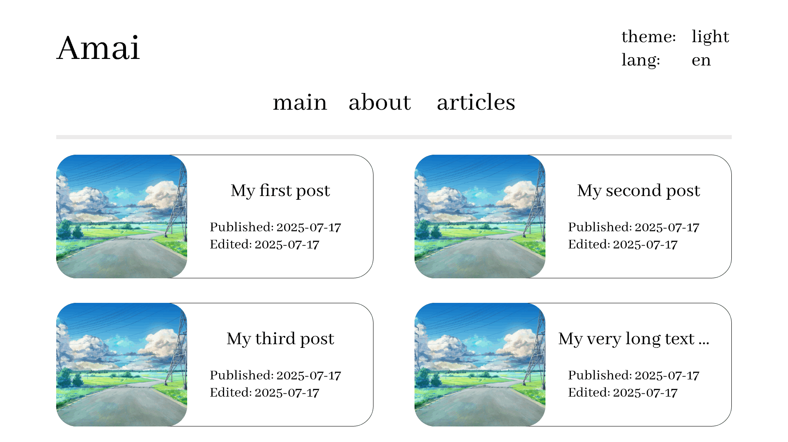

# 🌸 Amai

**A lightweight, minimalist blog designed for simplicity.**

[**View Gallery**](./readme/gallery) | [**Report Bug**](https://github.com/rnmz/amai/issues)

-----

## ✨ Features

  * **Markdown First:** Write your content in pure Markdown and let Amai handle the rest.
  * **High Compatibility:** Extensive support for various Markdown specifications.
  * **Blazing Fast:** Powered by Go and Astro for optimal performance.

-----

## 🛠️ Tech Stack

Amai is built using a robust and modern set of tools:

| Component | Technology |
| :--- | :--- |
| **Backend Framework** | [Gin Gonic](https://gin-gonic.com/) |
| **Database Driver** | [lib/pq](https://github.com/lib/pq) |
| **SQL Toolkit** | [sqlx](https://github.com/jmoiron/sqlx) |
| **Frontend Framework** | [Astro](https://astro.build/) |
| **Markdown Parser** | [Marked.js](https://marked.js.org/) |

-----

## 📝 Markdown Support

Amai ensures your formatting remains consistent across different standards:

  * **Markdown 1.0:** `100%`
  * **CommonMark 0.31:** `98%`
  * **GitHub Flavored Markdown (GFM):** `97%`

-----

## 🌍 Localization

We currently support the following languages:

  * 🇺🇸 **English** (100%)
  * 🇷🇺 **Russian** (100%)

-----

## 🖼️ Preview

<p align="center"\>


</p\>

-----

### 🚀 Getting Started

> **Note:** The frontend implementation is currently in progress. Stay tuned for the full release!

1.  **Clone the repo**
    ```bash
    git clone https://github.com/rnmz/amai.git
    ```
2.  **Install dependencies**
    ```bash
    go mod tidy
    ```
3. **Configure your server**
   
   Create a `.env` file based on `.env.example`
   ```bash
   cp .env.example .env
   ```

   Note: All variables are required for the server to start correctly!
